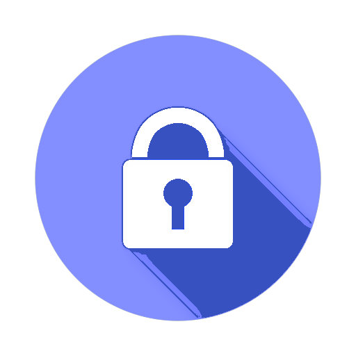

# SecureVault Docs v1.1.0
<p align="center">
  
</p>

## Introduction
SecureVault Docs v1.1.0 is a documentation website for SecureVault, a fictional password management tools designed to protect personal and work data.

**SecureVault Docs key features**:
- Static website built with Docusaurus and deployed on Netlify
  
  > SecureVault Docs is store on a static website built with the Docusaurus static site generator and uses Netlify as its hosting platform.
  
- User-friendly interface and easy navigation
  
  > The interface is designed to be intuitive, making it simple for users to find and access the information they need.
  
- Step-by-step guides and interactive learning materials
  
  > SecureVault provides clear, step-by-step instructions and interactive content to help users understand and use the documentation effectively.
  
- WCAG Compliance
  
  > The site meets The Web Content Accessibility Guidelines (WCAG) standards making it equally accessible to all users.
 
## Installation
To run the project on your local machine, do the following: 
1. Clone the project repository.
   ```
   $ git clone {the url to the GitHub repo}
   ```
3. Install dependencies.
   ```
   $ npm install
   ```
5. Start your application development server.
   ```
   $ npm start
   ```
## Contact
Let's connect on social media:
- [LinkedIn](www.linkedin.com/in/yauheniya-krasnikava-b56284217)
- [Hashnode](jenny-of-oldstones.hashnode.dev)
